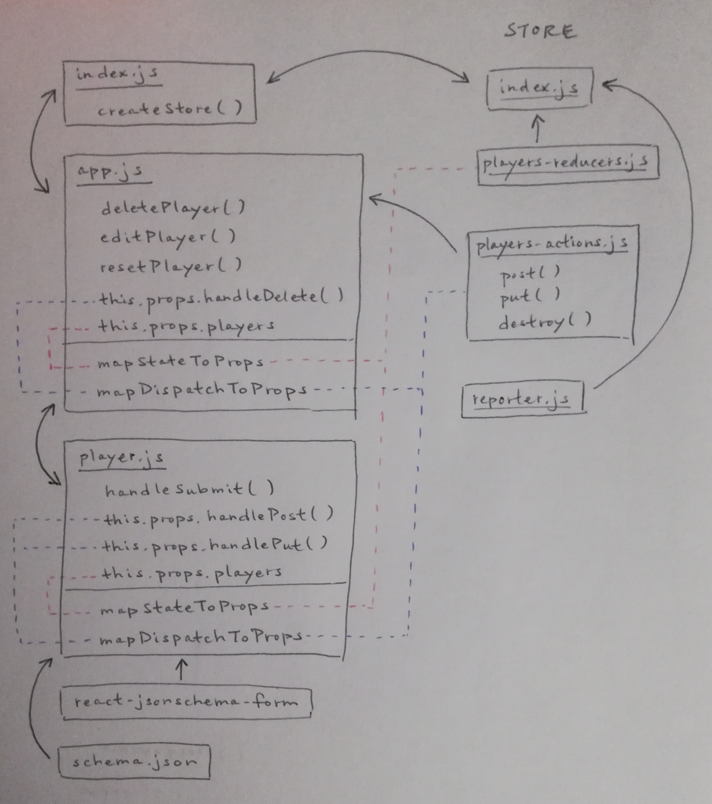

 LAB 32
=================================================

## Dynamic Forms

### Author: Katherine Smith

### Links and Resources
* [Implement the RESTful Reducers](https://codesandbox.io/s/n9384jo9x0)

## Implement the RESTful Reducers
### Modules
#### `index.js`
- Imports the App component
- Creates the store and connects to the store
- Contains the Main component
  - Passes the store down to the App component
  - Renders the App component
#### `app.js`
- Imports the Player component
- Imports actions from the store
- Contains the App component
  - Contains own state for id
  - Contains the deletePlayer method which handles deleting a player with a specific id
  - Contains the editPlayer method which handles editing a player with a specific id
  - Contains the resetPlayer method which handles setting the id back to null
  - Renders the players with buttons for edit and delete
  - Passes the id and the resetPlayer method to the Player component
  - Renders the Player component
- Contains mapStateToProps() which maps players state to props
- Contains mapDispatchToProps() which maps players dispatch to props
- Contains and exports the connected App component
#### `player.js`
- Imports the Form component from `react-json-schema-form`
- Imports the players schema
- Imports actions from the store
- Contains uiSchema to hide certain fields
- Contains the Player component
  - Contains own state for schema
  - Contains the handleSubmit method which handles submitting the form
  - Passes the schema, the uiSchema, the specific player, and the handleSubmit method to the Form component
  - Renders the Form component
- Contains mapStateToProps() which maps players state to props
- Contains mapDispatchToProps() which maps players dispatch to props
- Contains and exports the connected Player component

### Store Modules
#### `index.js`
- Imports reducers and reporter
- Exports function to create the store
#### `players-actions.js`
- Contains actions to be dispatched
#### `players-reducers.js`
- Maintains state for the store
#### `reporter.js`
- Provides middleware for the store

#### UML
